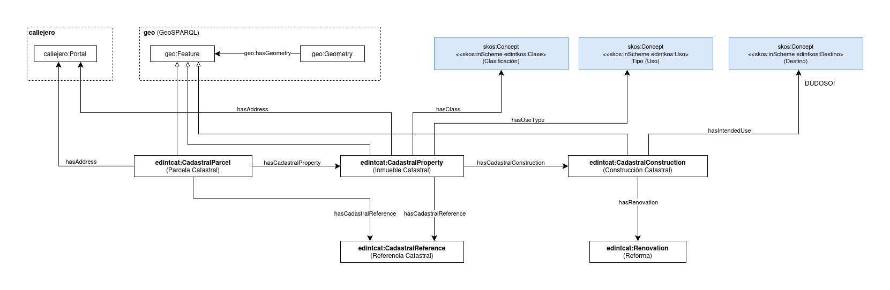

# Ontología para la representación del Catastro Inmobiliario Español

Esta ontología permite representar el dominio del Catastro Inmobiliario Español, centrada en parcelas catastrales, inmuebles catastrales y construcciones catastrales.

Está siendo desarrollada en el contexto del Espacio de Datos para las Infraestructuras Urbanas Inteligentes ([EDINT](https://edint.es/)).

# Propósito y alcance de la ontología

El propósito de esta ontología es modelar las entidades y relaciones fundamentales del Catastro Inmobiliario Español para habilitar la interoperabilidad de datos catastrales en el contexto de los datos enlazados (Linked Data). El alcance se limita a parcelas catastrales, inmuebles catastrales, construcciones catastrales, referencias catastrales, direcciones, usos y clasificaciones, y geometrías y áreas. Quedan fuera del alcance aspectos como titularidad de bienes, valoración catastral, datos de transmisiones y procesos administrativos.

# Prefijo y espacio de nombres

El prefijo de esta ontología es `edintcat`. Se publica en el espacio de nombres: http://vocab.linkeddata.es/datosabiertos/def/catastro/

# Modelo conceptual

# Estructura del repositorio

El repositorio contiene las siguientes carpetas:

| Folder | Description |
|--------|--------------|
| **diagrams/** | Stores diagrams and other resources representing the conceptual model of the ontology (e.g., class hierarchies, relationships). |
| **documentation/** | Stores the HTML or human oriented documentation of the ontology and related artefacts. |
| **examples/** | Includes examples that demonstrate how to instantiate or apply the ontology in real data scenarios. |
| **kos/** | Stores controlled vocabularies or KOS implementation, usually SKOS implementations in rdf. |
| **ontology/** | Contains the actual ontology implementation files in formats such as `.owl`, `.rdf`, `.ttl`, or `.jsonld`. |
| **requirements/** | Contains all documents used to define the ontology's requirements: data example, competency questions, functional requirements, use cases, etc. |
| **shapes/** | Contains the SHACL shapes used to define and validate ontology constraints. |
| **tests/** | Stores tests for ontology evaluation. |

# Mantenimiento y evolución

To manage those incidents or suggested improvements with respect to the vocabulary, we recommend you to follow
the guides provided in [Issues Management](./ISSUES.md) to
generate an issue.

# Financiación

Esta ontología ha sido desarrollada en el contexto del Espacio de Datos para las Infraestructuras Urbanas Inteligentes ([EDINT](https://edint.es/)).

